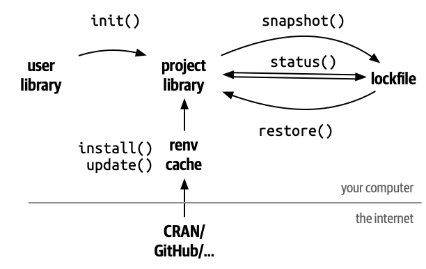

```{r setup, include = FALSE}
knitr::opts_chunk$set(
  collapse = TRUE,
  comment  = "#>",
  eval     = FALSE
)
```

The renv package helps you create create **r**eproducible **env**ironments for your R projects.
This vignette introduces you to the basic nouns and verbs of renv, like the user and project libraries, and key functions like `renv::init()`, `renv::snapshot()` and `renv::restore()`.
You'll also learn about some of the infrastructure that makes renv tick, some problems that renv doesn't help with, and how to uninstall it if you no longer want to use it.

{width="306"}

This vignette assumes that you're are already living a project-centric lifestyle and are familiar with a version control system, like Git and GitHub: we believe these are table stakes for reproducible data science.
If you're not already using projects, we recommend [Workflow: Projects](https://r4ds.had.co.nz/workflow-projects.html) from *R for Data Science*; if you're unfamiliar with [Git](https://git-scm.com/) and [GitHub](https://github.com/), we recommend [Happy Git and GitHub for the useR](https://happygitwithr.com).

## Libraries and repositories

Before we get started there are two important pieces of R jargon that you'll need to fully understand: libraries and repositories.

A **library** is a directory containing installed packages.
This term is confusing because you write `library(dplyr)`, making it easy to think of dplyr as a library, not a package.
And that confusion doesn't usually matter because you don't usually think too much about libraries, simply installing all packages to a **system library**[^1] that's shared across all projects.
With renv, you'll start using **project libraries,** so that each project has its own independent collection of packages.
You can see your current libraries with `.libPaths()` and see which packages are available in each library with `lapply(.libPaths(), list.files)`.

[^1]: More precisely, there can be up to three system libraries: an (optional) **user** library, an (optional) **site** library, and a **default** library (where base R packages are installed).

A **repository** is a source of packages; `install.packages()` gets a package from a *repository* (usually somewhere on the internet) and puts it in a *library* (a directory on your computer).
The most important repository is CRAN which is available to install packages from in just about every R session.
Other freely available repositories include [Bioconductor](https://bioconductor.org), the [Posit Public Package Manager](https://packagemanager.rstudio.com/client/#/), and [R Universe](https://r-universe.dev/search/) (which turns GitHub organisations into repositories).
You can see which repositories are currently set up in your session with `getOptions("repos")`; when you call `install.packages("{pkgname}")`, R will look for that package in each repository in turn.

## Getting started

To convert a project to use renv, call `renv::init()`.
It adds three new files and directories to your project:

-   The project library, `renv/library`, is a library that contains all packages currently used by your code[^2]. This is the key magic that makes renv work: instead of having a single library containing the packages that you use everywhere, renv gives you a separate library for each project. This gives you the benefits of **isolation**: different projects can use different versions of packages, and installing, updating, or removing packages in one project doesn't affect any other project.
-   The **lockfile**, `renv.lock`, records enough metadata about every package that it can be re-installed on a new machine. We'll come back to the lockfile shortly when we talk about `renv::snapshot()` and `renv::restore()`.
-   A project R profile, `.Rprofile`. This file is run automatically every time you start R (in that project), and renv uses it to configure your R session to use the project library. This ensures that once you turn on renv for a project, it stays on, until you deliberately turn it off.

[^2]: If you'd like to skip dependency discovery, you can call `renv::init(bare = TRUE)` to initialize a project with an empty project library.

The next important pair of tools is `renv::snapshot()` and `renv::restore()`.
`snapshot()` updates the lockfile with metadata about the currently-used packages in the project library.
This is useful because you can then share the lockfile and other people or other computers can easily reproduce your current environment by running `restore()`, which uses the metadata from the lockfile to install exactly the same version of every package.
This pair of functions gives you the benefits of **reproducibility** and **portability**: you are now tracking exactly which package versions you have installed, and can recreate them on other machines.

Now that you've got the a high-level lay of the land, we'll show a couple of specific workflows before discussing some of the reproducibility challenges that renv doesn't currently help with.

### Collaboration

One of the reasons to use renv is to make it easier to share your code in such way that everyone gets the same versions of the packages that you have.
As above, you'll start by calling `renv::init()`.
You'll then need to commit `renv.lock`, `.Rprofile`, `renv/settings.json` and `renv/activate.R` to version control, ensuring that others can recreate your project environment.
If you're using git, this is particularly simple because renv will create a `.gitignore` for you, and you can just commit all suggested files[^3].

[^3]: If you're using another version control system, you'll need to ignore `renv/library` and any other directories in `renv/`.

Now when one of your collaborators opens this project, renv will automatically bootstrap itself, downloading and installing the appropriate version of renv.
It will not, however, install the packages automatically --- you'll need to tell your collaborators to call `renv::restore()` to get all the packages they need (renv will also remind them to do this when they open the project).

### Installing packages

Over time, your project will need more packages.
One of the philosophies of renv is that your existing package management workflows should continue to work, so you can continue to use familiar tools like `install.packages()`[^4].
But you can also use `renv::install()`: it's a little less typing and supports installing packages from GitHub, Bioconductor, and more, not just CRAN.

[^4]: Behind the scene, renv shims `install.packages()`, `update.packages(),` and `remove.packages()` to call the renv equivalents.
    Learn more in `?renv::load.`

When you use renv, you'll typically end up with many libraries across your different projects, so you'll often need to install the same package multiple times.
It would be annoying if you had to download (or worse, compile) the package repeatedly, so renv uses a global package cache.
That means you only ever have to download and install a package once, and for each subsequent install, renv will just add a link from the project library to the global cache.
You can learn more about the cache in `vignette("package-install")`.

After installing the package and checking that your code still works, you should call `renv::snapshot()` to record the latest versions in your lockfile.
If you're collaborating with others, you'll need to commit those changes to git, and let them know that you've updated the lockfile and they should call `renv::restore()` when they're next working on a package.

### Updating packages

It's worth noting that there's a small risk associated with isolation: while your code will never break due to a change in another package, it will also never benefit from bug fixes.
So for packages under active development, we recommend that you regularly (at least once a year) use `renv::update()`[^5] to get the latest versions of all dependencies.
Similarly, if you're making major changes to a project that you haven't worked on for a while, it's often a good idea to start with an `renv::update()` before making any changes to the code.

[^5]: You can also use `update.packages()`, but `renv::update()` also works for packages installed from Bioconductor, GitHub, and Git.

After calling `renv::update()`, you should run the code in your project and make sure it still works (or make any changes needed to get it working).
Then call `renv::snapshot()` to record the new versions in the lockfile.
If you get stuck, and can't get the project to work with the new versions, you can call `renv::restore()` to roll back changes to the project library and revert to the known good state recorded in your lockfile.
If you need to roll back to an even older version, take a look at `renv::history()` and `renv::revert()`.

`renv::update()` will also update renv itself, ensuring that you get all the latest features.
See `renv::upgrade()` if you ever want to upgrade just renv, or you need to install a development version from GitHub.

## Infrastructure

Now that you've got the basic usage of renv under your belt, it's time to learn a bit more about the underlying infrastructure.
You typically won't touch any of these files directly, but it's good to understand what they do because you will see them in git diffs.

`renv::init()` creates the following important files and directories:

-   `.Rprofile:` Used to activate renv for new R sessions launched in the project by calling `source("renv/activate.R")`.
-   `renv/activate.R`: The activation script run by the project `.Rprofile`. This ensures that the project library is made active for newly launched R sessions. This ensures that any new R processes launched within the project directory will use the project library, and hence are isolated from the regular system library.
-   `renv.lock`: The lockfile, describing the state of your project's library at a particular point in time.
-   `renv/library`: The private project library.
-   `renv/settings.json`: Project settings -- see `?settings` for more details.

Of these files, `renv.lock` is probably the most important to understand as it will change the most over the life of a project.
An `renv.lock` is a json file that records all the information needed to recreate your project in the future.
It includes:

-   The version of R used.
-   Your R repositories.
-   Package records defining each R package, their version, and their installation source.

Here is an example lockfile, including the packages markdown and mime:

```         
{
  "R": {
    "Version": "`r getRversion()`",
    "Repositories": [
      {
        "Name": "CRAN",
        "URL": "https://cloud.r-project.org"
      }
    ]
  },
  "Packages": {
    "markdown": {
      "Package": "markdown",
      "Version": "1.0",
      "Source": "Repository",
      "Repository": "CRAN",
      "Hash": "4584a57f565dd7987d59dda3a02cfb41"
    },
    "mime": {
      "Package": "mime",
      "Version": "0.7",
      "Source": "Repository",
      "Repository": "CRAN",
      "Hash": "908d95ccbfd1dd274073ef07a7c93934"
    }
  }
}
```

The package records are created using the currently-installed copies of packages as a "source of truth".
When you first do `renv::init()`, they'll be the same as the versions installed in your system library, but as the project progresses they'll evolve independently.
The fields written into each package record are derived from the installed package's `DESCRIPTION` file, and include the data required to recreate installation, regardless of whether the package was installed from [CRAN](https://cran.r-project.org/), [Bioconductor](https://www.bioconductor.org/), [GitHub](https://github.com/), [Gitlab](https://about.gitlab.com/), [Bitbucket](https://bitbucket.org/), or elsewhere.
You can learn more about the sources renv supports in `vignette("package-sources")`.

## Caveats

It is important to emphasize that renv is not a panacea for reproducibility.
Rather, it is a tool that can help make projects reproducible by solving one small part of the problem: R packages.
Ultimately, making a project reproducible will always require thought, not just mechanical usage of a tool: what does it mean for a particular project to be reproducible, and how can you use tools to meet that particular goal of reproducibility?

The most important piece of the puzzle that renv tracks, but doesn't help with, is the version of R.
renv can't easily help with this because it's run inside of R, but you might find tools like [rig](https://github.com/r-lib/rig) helpful, as they make it easier to switch between multiple version of R on one computer.

Other components of the system that can cause differences in output are the operating system, versions of system libraries, the compilers used to build R and R packages, and so on.
Keeping a 'stable' machine image is a separate challenge, but [Docker](https://www.docker.com/) is one popular solution.
See also `vignette("docker", package = "renv")` for recommendations on how Docker can be used together with renv.

A salient example of this is the rmarkdown package, as it relies heavily on [pandoc](https://pandoc.org/).
However, because pandoc is not bundled with the rmarkdown package simply restoring an renv project using rmarkdown may not be sufficient: you also needs to ensure the project is run in a environment with the correct version of pandoc available.

You also need to be aware that package installation may fail if a package was originally installed through a binary, but that binary is no longer available.
renv will attempt to install the package from source, but this can (and often will) fail due to missing system prerequisites.

## Uninstalling renv

If you find renv isn't the right fit for your project, deactivating and uninstalling it is easy.

-   To deactivate renv in a project, use `renv::deactivate()`.
    This removes the renv auto-loader from the project `.Rprofile`, but doesn't touch any other renv files used in the project.
    If you'd like to later re-activate renv, you can do so with `renv::activate()`.

-   To completely remove renv from a project, call `renv::deactivate(clean = TRUE)`.
    If you later want to use renv for this project, you'll need to start from scratch with `renv::init().`

If you want to stop using renv for all your projects, you'll also want to remove `renv'`s global infrastructure with the following R code[^6]:

[^6]: If you've customized any of renv's infrastructure paths as described in `?renv::paths`, then you'll need to find and remove those customized folders as well.

```{r, eval = FALSE}
root <- renv::paths$root()
unlink(root, recursive = TRUE)
```

You can then uninstall the renv package with `utils::remove.packages("renv")`.
